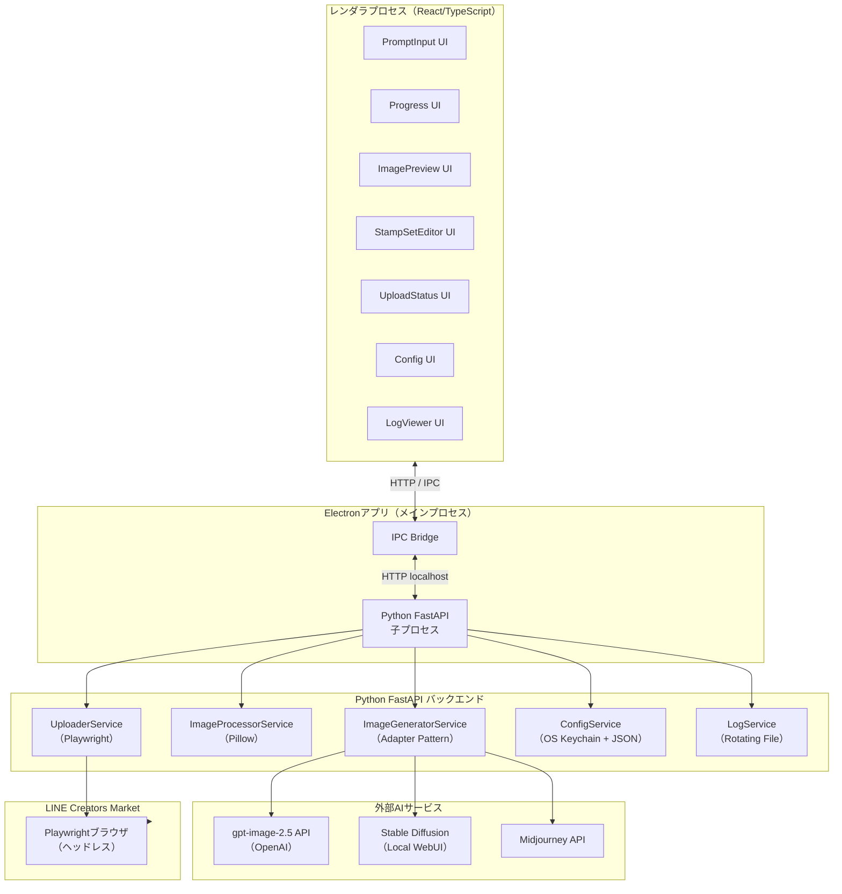
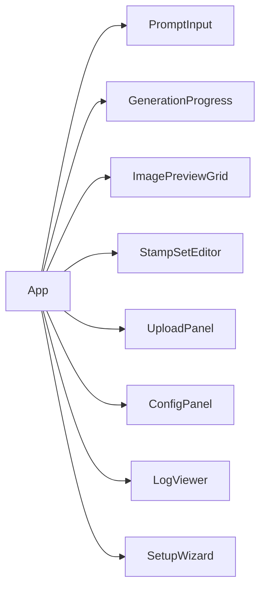

# Design Document: LINEスタンプジェネレーター

## Overview

LINEスタンプジェネレーターは、日本語ユーザーが自然言語でプロンプトを入力するだけで、AIが複数枚のLINEスタンプ画像を自動生成し、LINE規格への変換・編集・LINE Creators Marketへのアップロードまでを一括で行うローカルデスクトップアプリケーションである。

### ゴール

- デザインスキルや専門知識なしにLINEスタンプを作成・申請できる体験の提供
- AI画像生成（OpenAI gpt-image-2.5 / Stable Diffusion / Midjourney）への統一インターフェース
- LINE規格（サイズ・フォーマット・ファイルサイズ）への自動準拠
- LINE Creators MarketへのブラウザAPI経由の自動アップロード
- APIキー・認証情報のセキュアな永続化

### 動作環境

- **プラットフォーム**: Windows / macOS / Linux（ローカル動作）
- **形態**: Electronデスクトップアプリ（フロントエンド: React/TypeScript、バックエンド: Python FastAPI）

---

## Architecture

### 全体構成



### アーキテクチャの決定事項

| 決定 | 理由 |
|------|------|
| Electron + Python FastAPI | TypeScript UIの豊富なエコシステムと、画像処理・ML系ライブラリが充実したPythonを組み合わせる。FastAPIをlocalhost子プロセスとして起動することで、IPC複雑性を最小化。 |
| Adapter Patternで複数AIエンジンを抽象化 | OpenAI gpt-image-2.5 / SD / Midjourneyのインターフェースを統一し、将来の追加・切り替えを容易にする。 |
| Playwrightによるブラウザ自動化アップロード | LINE Creators MarketのPublic APIが存在しないため、Webブラウザ操作による自動化を採用。ヘッドレスモードで動作。 |
| OS Keychain（keytar / python-keyring）で認証情報を保管 | APIキーや認証情報をプレーンテキストで保存せず、OS提供のセキュアストレージを利用。 |

---

## Components and Interfaces

### フロントエンド コンポーネント



#### PromptInput

ユーザーのプロンプト入力フォームと送信コントロールを提供する。

```typescript
interface PromptInputProps {
  onSubmit: (request: GenerationRequest) => void;
  history: PromptHistory[];
  onHistorySelect: (prompt: string) => void;
}

// バリデーション関数（純粋関数 - プロパティテスト対象）
function validatePrompt(text: string): ValidationError | null
function validatePromptLength(text: string): ValidationError | null
```

#### ImagePreviewGrid

生成された画像をグリッド表示し、個別操作（削除・再生成）を提供する。

```typescript
interface ImagePreviewGridProps {
  images: GeneratedImage[];
  onDelete: (index: number) => void;
  onRegenerate: (index: number) => void;
}
```

#### StampSetEditor

スタンプセットのメタデータ編集・差し替え・エクスポートを提供する。

```typescript
interface StampSetEditorProps {
  stampSet: StampSet;
  onTitleChange: (title: string) => void;
  onDescriptionChange: (description: string) => void;
  onReplaceImage: (index: number, file: File) => void;
  onExport: (outputPath: string) => void;
  onUpload: () => void;
}

// バリデーション関数（純粋関数 - プロパティテスト対象）
function validateTitle(title: string): ValidationError | null
function validateDescription(description: string): ValidationError | null
function validateFileType(filename: string): ValidationError | null
```

### バックエンド サービス

#### ImageGeneratorService

AI画像生成エンジンに対するAdapterインターフェース。

```python
class ImageGeneratorAdapter(ABC):
    @abstractmethod
    async def generate(
        self,
        prompt: str,
        style: Optional[str],
        count: int,
        timeout_seconds: int = 180,
    ) -> AsyncIterator[GenerationProgress]:
        ...

class OpenAIImageAdapter(ImageGeneratorAdapter): ...  # gpt-image-2.5 (flare / sunburst)
class StableDiffusionAdapter(ImageGeneratorAdapter): ...
class MidjourneyAdapter(ImageGeneratorAdapter): ...

class ImageGeneratorService:
    def __init__(self, adapter: ImageGeneratorAdapter): ...
    async def generate_batch(self, request: GenerationRequest) -> AsyncIterator[GenerationProgress]: ...
    async def generate_single(self, request: GenerationRequest, index: int) -> GeneratedImage: ...
```

##### OpenAIImageAdapter（gpt-image-2.5）

OpenAI の画像生成 API（`POST /v1/images/generations`）を呼び出す。モデルは `gpt-image-2.5-flare`（速度優先・デフォルト）または `gpt-image-2.5-sunburst`（品質・編集精度優先）を Config の `openai_model` から選択する。

| パラメータ | 設定値 | 備考 |
|-----------|--------|------|
| `model` | `gpt-image-2.5-flare` / `gpt-image-2.5-sunburst` | Config の `openai_model` |
| `background` | `transparent` | LINEスタンプは透過必須。`transparent` 使用時は `output_format` を `png`/`webp` にする必要がある |
| `output_format` | `png` | 透過PNGを直接取得（後段の Pillow 変換前提を満たす） |
| `quality` | `auto`（デフォルト） | `low`/`medium`/`high`/`xhigh`/`max`/`auto` から選択可能 |
| `size` | `1024x1024` | 生成後に ImageProcessorService が LINE規格へリサイズ。メイン画像のみ中央クロップ |

- APIキーは OS Keychain の `openai_api_key` から取得し、リクエストヘッダにのみ使用する。ログ・例外・Config ファイルには一切含めない。
- `gpt-image-2.5` は `background="transparent"` で透過PNGを直接生成できるため、従来の DALL·E 3（透過非対応）に比べて LINEスタンプ用途との親和性が高い。ImageProcessorService は元画像全体を残してスタンプ画像を370×320px以内に縮小し、サムネイル画像は透明な余白で96×74pxに調整する。

#### ImageProcessorService

LINE規格への画像変換・バリデーション。Pillowを使用する。

```python
class ImageProcessorService:
    # LINE規格定数
    STAMP_MAX_W = 370
    STAMP_MAX_H = 320
    MAIN_W, MAIN_H = 240, 240
    THUMB_W, THUMB_H = 96, 74
    MAX_FILE_BYTES = 1_048_576  # 1MB

    async def process_image(self, source_path: str) -> ProcessedImageSet: ...
    def resize_to_stamp(self, img: Image) -> Image: ...
    def center_crop_to_aspect(self, img: Image, target_w: int, target_h: int) -> Image: ...
    def compress_to_limit(self, img: Image, max_bytes: int) -> tuple[bytes, bool]: ...
    def validate(self, img_bytes: bytes, expected_w: int, expected_h: int) -> ValidationResult: ...
```

#### UploaderService

Playwrightを使ったLINE Creators Marketへのブラウザ自動化アップロード。

```python
class UploaderService:
    async def upload(
        self,
        stamp_set: StampSet,
        credentials: LineCredentials,
        on_progress: Callable[[UploadProgress], None],
    ) -> UploadResult: ...
    async def _login(self, page: Page, credentials: LineCredentials) -> None: ...
    async def _upload_images(self, page: Page, stamp_set: StampSet) -> None: ...
    async def _submit_for_review(self, page: Page) -> str: ...  # returns application_id
```

#### ConfigService

設定の永続化とOS Keychainへのセキュアな認証情報管理。

```python
class ConfigService:
    CONFIG_FILE = "~/.line-stamp-gen/config.json"
    KEYCHAIN_SERVICE = "line-stamp-generator"

    def load(self) -> Config: ...
    def save(self, config: Config) -> None: ...
    def export_sanitized(self) -> dict: ...  # APIキー・認証情報を除いてエクスポート
    def import_from_dict(self, data: dict) -> None: ...  # スキーマ検証後に上書き
    def save_credential(self, key: str, value: str) -> None: ...  # OS Keychain
    def get_credential(self, key: str) -> Optional[str]: ...
```

#### LogService

ローテーション付きファイルロガー。

```python
class LogService:
    MAX_TOTAL_BYTES = 100 * 1024 * 1024  # 100MB
    MAX_DISPLAY_ENTRIES = 1000

    def log(self, level: LogLevel, module: str, message: str) -> None: ...
    def rotate_if_needed(self) -> None: ...
    def get_entries(
        self,
        level: Optional[LogLevel] = None,
        date_from: Optional[datetime] = None,
        date_to: Optional[datetime] = None,
        limit: int = 1000,
    ) -> list[LogEntry]: ...
```

---

## Data Models

```typescript
// フロントエンド（TypeScript）

type StampCount = 8 | 16 | 24 | 32 | 40;
type GenerationStyle = "かわいい" | "クール" | "ゆるい" | "リアル";
type GenerationMode = "batch" | "preview_approval";

interface GenerationRequest {
  prompt: string;
  count: StampCount;
  style?: GenerationStyle;
  mode: GenerationMode;
}

interface GeneratedImage {
  index: number;
  dataUrl: string;        // base64 data URL for preview
  tempFilePath: string;   // バックエンド側の一時ファイルパス
  status: "pending" | "generating" | "done" | "error";
  errorMessage?: string;
}

interface StampImage {
  id: string;             // セット内で安定した画像ID（生成項目IDを継承。差し替え・再変換でも不変）
  stampPath: string;      // 370×320px以内 透過PNG
  mainImagePath: string;  // 240×240px PNG
  thumbnailPath: string;  // 96×74px PNG
  validationResult: ValidationResult;
}

interface StampSet {
  title: string;          // 1-40文字
  description: string;    // 0-160文字
  images: StampImage[];
  mainImageId: string | null;  // main.png／LINEメイン画像の元画像ID（null=未選択）
  tabImageId: string | null;   // tab.png／トークルームタブ画像の元画像ID（null=未選択）
  isValidForUpload: boolean;
}

interface ValidationResult {
  passed: boolean;
  sizeOk: boolean;
  formatOk: boolean;
  fileSizeOk: boolean;
  fileSizeExceeded: boolean;  // true = 圧縮しても1MB超過（調整不可）
  details: string;
}

interface UploadResult {
  success: boolean;
  applicationId?: string;
  status?: string;
  errorType?: "network" | "auth" | "validation" | "unknown";
  retryCount: number;
  errorMessage?: string;
}

interface Config {
  aiEngine: "openai" | "stable_diffusion" | "midjourney";
  outputDirectory: string;
  openaiModel: "gpt-image-2.5-flare" | "gpt-image-2.5-sunburst";  // デフォルト: "gpt-image-2.5-flare"
  sdEndpoint: string;     // Stable Diffusion WebUI endpoint
  // APIキー・認証情報はOS Keychainに保存（Configファイルには含まない）
}

interface PromptHistory {
  id: string;
  text: string;
  createdAt: string;      // ISO 8601
}

interface LogEntry {
  timestamp: string;      // ISO 8601
  level: "INFO" | "WARN" | "ERROR";
  module: string;
  message: string;
}
```

```python
# バックエンド（Python dataclasses）

@dataclass
class ProcessedImageSet:
    stamp_path: str
    main_image_path: str
    thumbnail_path: str
    validation: ValidationResult

@dataclass
class ValidationResult:
    passed: bool
    size_ok: bool
    format_ok: bool
    file_size_ok: bool
    file_size_exceeded: bool  # 圧縮最大レベルでも1MB超過
    details: str

@dataclass
class GenerationProgress:
    completed: int
    total: int
    latest_image_path: Optional[str]
    error: Optional[GenerationError]

@dataclass
class UploadResult:
    success: bool
    application_id: Optional[str]
    status: Optional[str]
    error_type: Optional[str]
    retry_count: int
    error_message: Optional[str]

@dataclass
class LogEntry:
    timestamp: str   # ISO 8601
    level: str       # INFO / WARN / ERROR
    module: str
    message: str

@dataclass
class LineCredentials:
    email: str
    password: str   # OS Keychainから取得
```

---

## Correctness Properties

*プロパティとは、システムの有効な全実行において成立すべき特性や振る舞いのことである。形式的に言えば、「システムが何をすべきか」についての普遍的な命題である。プロパティは人間が読める仕様と機械検証可能な正確性の保証をつなぐ架け橋となる。*

---

### Property 1: プロンプト文字数バリデーション

*任意の* 文字列 `s` に対して、`len(s) > 1000` であればバリデーション関数はエラーを返し、`len(s) <= 1000` かつ `s` が空白のみでなければ通過する。

**Validates: Requirements 1.2**

---

### Property 2: 空白・空文字プロンプトの拒否

*任意の* 空白文字（スペース・タブ・改行）のみで構成された文字列に対して、プロンプトバリデーション関数は必ずエラーを返す。

**Validates: Requirements 1.3**

---

### Property 3: プロンプト履歴のFIFO管理

*任意の* n 件（n >= 0）のプロンプト送信操作のシーケンスに対して、履歴リストは常に 20 件以下であり、最新のものが先頭に来る順序が保たれ、21 件目の追加時には最古の 1 件が削除される。

**Validates: Requirements 1.7**

---

### Property 4: プレビュー承認モードの残り枚数

*任意の* 有効な生成枚数 `n`（8, 16, 24, 32, 40 のいずれか）に対して、プレビュー承認モードで「残りを生成する」ボタンが押されたとき、ImageGeneratorService への追加生成リクエストの count は常に `n - 1` である。

**Validates: Requirements 2.3**

---

### Property 5: LINE規格変換の出力サイズ保証

*任意の* サイズ・形式の入力画像に対して、ImageProcessorService が変換を完了した後、スタンプ画像は 370×320px 以内の透過 PNG、メイン画像は 240×240px の PNG、サムネイル画像は 96×74px の PNG となる。

**Validates: Requirements 3.1, 3.2**

---

### Property 6: ファイルサイズ 1MB 以下保証

`file_size_exceeded` フラグが `false` である *任意の* 変換済み画像に対して、PNG バイト列のサイズは常に 1,048,576 バイト（1 MB）以下である。

**Validates: Requirements 3.3**

---

### Property 7: スタンプ画像・サムネイル画像の切り抜き防止

*任意の* アスペクト比を持つ入力画像に対して、スタンプ画像とサムネイル画像は元画像全体をアスペクト比を保って収める。サムネイル画像は96×74pxの透明キャンバスに中央配置する。

**Validates: Requirements 3.5**

---

### Property 8: バッチ変換のエラー継続処理

`n` 枚の画像バッチを処理するとき、*任意の* インデックス `i` の画像でファイル読み込み／書き込みエラーが発生しても、インデックス `i` 以外の `n - 1` 枚の変換処理が完了（成功または別エラー）する。

**Validates: Requirements 3.7**

---

### Property 9: Stamp_Set メタデータバリデーション

*任意の* 文字列 `title` に対して、長さが 1〜40 文字の範囲内なら `validateTitle` はエラーなしを返し、0 文字または 41 文字以上ならエラーを返す。*任意の* 文字列 `description` に対して、長さが 0〜160 文字の範囲内なら `validateDescription` はエラーなしを返し、161 文字以上ならエラーを返す。

**Validates: Requirements 4.2, 4.3**

---

### Property 10: ファイル種別バリデーション

*任意の* ファイル名に対して、拡張子が `.png`（大文字小文字を問わない）以外であれば `validateFileType` は常にエラーを返す。

**Validates: Requirements 4.5**

---

### Property 11: アップロードリトライロジック

*任意の* ネットワークエラーパターン（エラー回数 0〜5）に対して、UploaderService のリトライ処理は最大 3 回で停止し、3 回連続失敗した場合には `UploadResult.retry_count == 3` かつ `UploadResult.success == false` が成立する。認証エラー時はリトライ回数が 0 のまま即時停止する。

**Validates: Requirements 5.4, 5.7**

---

### Property 12: バリデーション状態とアップロードボタンの連動

*任意の* `StampSet` 状態に対して、`isValidForUpload == false` であればアップロードボタンは無効化（`disabled`）であり、`isValidForUpload == true` のときのみ有効化される。

**Validates: Requirements 5.6**

---

### Property 13: Config エクスポートのセンシティブフィールド除外

*任意の* `Config` 状態（APIキーや認証情報が設定されているか否かに関わらず）に対して、`export_sanitized()` が返す JSON オブジェクトには `api_key` および `password` を含む認証情報フィールドが存在しない。

**Validates: Requirements 6.5**

---

### Property 14: Config JSON ラウンドトリップ

*任意の* 有効な `Config` オブジェクト（APIキーや認証情報フィールドを除く）に対して、`export_sanitized()` でシリアライズし、`import_from_dict()` でインポートすると元の `Config` と同一内容が復元される。

**Validates: Requirements 6.6**

---

### Property 15: 不正 Config インポート時のデータ保全

*任意の* 不正 JSON 文字列またはスキーマ違反 dict に対して、`import_from_dict()` を呼び出した後の `Config` は呼び出し前と同一であり、変更されていない。

**Validates: Requirements 6.7**

---

### Property 16: ログエントリのフォーマット

*任意の* ログ生成呼び出し（レベル・モジュール名・メッセージの任意の組み合わせ）に対して、`LogService.log()` が書き込むエントリには ISO 8601 形式のタイムスタンプ・ログレベル（INFO/WARN/ERROR）・モジュール名・メッセージが含まれる。

**Validates: Requirements 7.2**

---

### Property 17: ログローテーションの上限保証

*任意の* ログファイルセット（合計サイズが 100 MB を超えるもの）に対して、`rotate_if_needed()` を実行した後、ログファイルの合計サイズは常に 100 MB 以下である。

**Validates: Requirements 7.3**

---

### Property 18: ログ表示件数の上限

*任意の* 件数のログエントリが存在するとき、`get_entries(limit=1000)` が返すリストの長さは常に 1000 以下である。

**Validates: Requirements 7.4**

---

### Property 19: ログフィルタリングの正確性

*任意の* ログエントリセットと *任意の* フィルタ条件（ログレベル・日付範囲の組み合わせ）に対して、`get_entries()` が返す全エントリは指定したフィルタ条件を満たし、条件を満たさないエントリは含まれない。

**Validates: Requirements 7.6**

---

### Property 21: テンプレート選択の不変条件

*任意の* テーマ・枚数と、選択・解除・項目編集・先頭N件に戻す・選択解除の *任意の* 操作列に対して、選択中の項目数はN以下で、上限時の選択は状態を変えずに案内を返す。positionは0から連番、選択中と下書きを合わせたitem IDは一意、テンプレート由来の項目はカタログ番号順に並び、編集した項目は選択を外して戻しても編集内容を保持する。

**Validates: 追加要件「テンプレート40件からの項目選択」1〜8**

---

### Property 20: ZIPとアップロード要求は同じ選択画像を参照する

*任意の* 枚数（1〜40）と *任意の* メイン／タブの選択位置に対して、`toExportCreateRequest` と `toUploadStartRequest` は同じ選択IDを送り、ZIP要求内でIDから解決したメイン用・タブ用パスはアップロード要求の `mainImagePath`／`thumbnailPath` と一致し、スタンプ画像の順序は変わらない。

**Validates: 追加要件「メイン画像・トークルームタブ画像の元画像選択」2, 4**

---

## Error Handling

### エラー分類と対応方針

| エラー種別 | 発生箇所 | リトライ | ユーザー通知 | 継続処理 |
|-----------|---------|---------|------------|---------|
| AI生成 タイムアウト（180秒） | ImageGeneratorService | ユーザー判断 | エラーインデックスと種別を表示 | 生成済み画像を保持 |
| AI生成 APIエラー | ImageGeneratorService | ユーザー判断 | エラーインデックスと種別を表示 | 生成済み画像を保持 |
| 画像変換 ファイルI/Oエラー | ImageProcessorService | 自動スキップ | 該当インデックスとエラー内容を即時表示 | 他画像の変換を継続 |
| PNG圧縮 1MB超過（調整不可） | ImageProcessorService | なし | Validation_Resultに「ファイルサイズ超過（調整不可）」を表示 | 他画像の変換を継続 |
| ZIP書き込みエラー | エクスポート処理 | なし | 「エクスポートに失敗しました」とエラー詳細 | Stamp_Setデータ保持 |
| ネットワークエラー（アップロード） | UploaderService | 自動3回（5秒間隔） | 3回失敗時にエラー種別・回数・詳細を表示 | - |
| 認証エラー（アップロード） | UploaderService | なし（即時停止） | 認証エラー旨をUpload_Resultに記録して表示 | - |
| Config インポート不正 | ConfigService | なし | エラー内容を表示 | 既存Config保持 |
| ログ書き込みエラー | LogService | なし | UIに通知のみ | 主要機能を継続 |

### エラーメッセージの方針

- すべてのユーザー向けエラーメッセージは日本語で記述する
- 技術的な詳細（スタックトレース等）はログファイルに記録し、UIには分かりやすい要約と推奨される対処方法を表示する
- エラーメッセージには可能な限りエラーが発生した画像インデックスや操作名を含め、ユーザーが問題箇所を特定できるようにする

---

## Testing Strategy

### デュアルテスト方針

このアプリは「ユニットテスト（例示ベース）」と「プロパティベーステスト（PBT）」の両方を用いる。

- **ユニットテスト**: 特定の入力に対する期待動作の確認、UIコンポーネントのレンダリング、エラーハンドリング、外部サービスとのインテグレーション確認
- **プロパティベーステスト**: バリデーションロジック・変換ロジック・状態管理ロジックの普遍的な正確性の検証

### 使用するテストフレームワーク

| 対象 | フレームワーク |
|------|--------------|
| TypeScript フロントエンド（ユニット・PBT） | Vitest + fast-check |
| Python バックエンド（ユニット・PBT） | pytest + Hypothesis |
| E2E / インテグレーション | Playwright Test |

### プロパティベーステスト設定

- 各プロパティテストは **最低 100 イテレーション** で実行する（fast-check デフォルト: 100、Hypothesis デフォルト: 100）
- 各プロパティテストには以下の形式でタグコメントを付与する:
  ```
  # Feature: line-stamp-generator, Property {番号}: {プロパティ本文の要約}
  ```

### テスト対象のカバレッジ方針

#### プロパティベーステスト（Hypothesis / fast-check）

```python
# 例: Property 3 - プロンプト履歴FIFO管理
# Feature: line-stamp-generator, Property 3: 履歴は常に20件以下・新しい順・21件目追加時に最古削除
@given(prompts=st.lists(st.text(min_size=1), min_size=0, max_size=50))
@settings(max_examples=100)
def test_prompt_history_fifo(prompts):
    history = PromptHistory()
    for p in prompts:
        history.add(p)
    assert len(history.entries) <= 20
    if len(prompts) >= 2:
        # 最新のものが先頭
        assert history.entries[0].text == prompts[-1]
```

#### ユニットテスト（pytest / Vitest）

- ImageProcessorService の具体的なサイズ変換（例: 800×600px → 370×320px）
- UploadResult の構造確認
- Config の保存・読み込みのラウンドトリップ（具体例）
- エラー時のUIメッセージ表示（スナップショット）

#### インテグレーションテスト（Playwright Test）

- AI生成フロー全体（モックAPI使用）
- ZIP エクスポートの実ファイル生成
- LINE Creators Market アップロードフロー（ステージング環境またはモック）

#### スモークテスト

- アプリ起動時の初回セットアップウィザード表示
- Config 画面の必要フィールド存在確認
- AI エンジン選択肢の存在確認
- 認証情報保存後にプレーンテキストでファイルに記録されていないことの確認

### ユニットテストとプロパティテストのバランス

- バリデーション関数・変換関数・状態管理ロジックは原則プロパティテストでカバーする
- UIコンポーネントのレンダリングはスナップショットテストを使用する
- 外部サービス（AI API、Playwright、OS Keychain）はすべてモックを使用する
- パフォーマンス要件（変換 10 秒以内等）はスモークテストとして別途計測する
# 項目別企画の設計

`PromptInput` は共通プロンプト（1000文字以下）、テーマ、枚数、スタイル、モードを受け取り、初期選択として `createStampPlan`（カタログ先頭N件）を使う。`StampTemplateSelector` で生成する項目を選んだあと、`StampPlanEditor` が全項目の意味・表情・ポーズ・小物を編集し、`validateStampPlan` を通過したときだけ `App` が画像生成を始める。企画生成関数は定型データに閉じ、将来の提案方式へ差し替えられる。

`GenerationRequest` の `items` は全枚数分の確定済み企画である。各項目は `id`、`position`、`meaning`、`expression`、`pose`、`prop` を持つ。部分生成でも全件を `GenerationStartRequest` に含め、`count` と `startIndex` で対象範囲を指定する。Electron の `image:generate` と preload はこのオブジェクトを FastAPI `/generate` に透過する。FastAPI は件数（8/16/24/32/40）、位置の連続性、IDの一意性、意味の重複、必須値、項目別100文字上限、対象範囲をSSE開始前に検証する。既存のプロンプト単体要求は後方互換として受け付ける。

`ImageGeneratorService.generate_batch` は対象位置ごとに `build_stamp_prompt` を呼び、共通設定、対象の1項目、透過・単一画像・項目別文字設定に応じた出力ルールだけをアダプタへ渡す。アダプタのモデル・品質・透過PNGパラメータは変更しない。アダプタからの局所インデックスは `start_index + offset` に変換する。`generate_single` も対象の絶対位置を使用する。

`App` は生成開始時の企画を `currentRequest` に保存する。プレビュー承認・削除後の生成は確定済み企画を使い、個別再生成は対象項目を編集して更新した最新企画を使う。`GeneratedImage.itemId` と絶対 `index` によって企画と結果を対応させる。プレビューは未生成の位置も企画ラベル付きで表示し、削除後はその位置から再生成できる。成功済み画像の再生成が失敗したときは元画像を残す。既存の画像処理・エクスポートは絶対位置でソートした結果を受け取る。画像参照によるキャラクター統一、AI企画提案、画像類似判定は将来の拡張とする。

## レビュー時の個別再生成

`ImagePreviewGrid` の成功画像カードは「再生成」で `RegenerationEditor` を開く。カード内に元画像を表示したまま、最新の確定済み項目を入力ドラフトへ複製する。フォームは意味・表情・ポーズ・小物（各100文字以下）と追加の指示（500文字以下）を持ち、`validateStampPlan` によって必須値と全企画内の意味重複を検証する。キャンセルはドラフトを破棄する。Escape キーでも閉じる。

確定時に `App` は元の `id` と `position` を固定して対象項目だけを更新し、`UPDATE_CURRENT_REQUEST` で画像を消さずに保存する。更新済み要求を同じ関数呼び出しから `toGenerationStartRequest` に渡し、全企画・`count: 1`・対象の絶対 `startIndex` を Electron IPC へ送る。実行情報にも送信要求を記録する。失敗時は従来の成功画像を維持し、編集済み条件は次回のフォーム初期値にする。失敗画像と削除済み枠は最新の個別条件で直接再試行する。生成中は操作を無効化する。

`StampPlanItem.additionalInstructions?` は既存データとの互換性を保つ。FastAPI `StampPlanItemPayload.additional_instructions` は既定値空文字、最大500文字で、camelCase 入力を受ける。サービスへは snake_case の dict を渡す。`build_stamp_prompt` は対象の最新の意味・表情・ポーズ・小物を置き換えて組み立て、空でない追加指示だけを独立節として挿入する。先頭項目の追加指示を他項目へ流用しない。

## 生成設定の保存・読み込みの設計

`GenerationPreset` はschemaVersion:1、UUID、名前、ISO日時、request（共通条件と全items）、options（モデル・品質）を持つ。`GenerationPresetSnapshot` には認証・画像・実行情報を含めない。`createPresetSnapshot` が許可項目のみコピーし、共有の `parsePresetSnapshot` と `parseGenerationPreset` が型とサイズに対応する構造制限を検証する。項目位置は配列順の0始まり連番、項目IDは100文字以下のASCII安定IDで一意とする。保存名は1～100文字で日本語・パス区切り文字も許すが、制御文字は拒否し、パスに使わない。

`electron/generationPresets.ts` のリポジトリは `app.getPath("userData")/generation-presets/<UUID>.json` に保存する。メインプロセスにlist/load/save/deleteの4チャネルを登録し、preloadの `window.api.generationPresets` からのみ呼ぶ。汎用ファイル書込APIは公開しない。変更操作は直列化し、一時ファイルへwrite→fsync→close→renameする。失敗時は一時ファイルだけを片付け、元ファイルを維持する。上書きは元のIDと作成日時を維持する。listは各ファイルを個別検証し、正常な要約と問題のあるIDを分けて返す。シンボリックリンクと256KiB超のファイルを拒否し、破損したファイルで全一覧を止めない。

保存可能性の検証は生成可能性と分ける。1000文字以下の空プロンプトや項目の空欄・重複は保存可能で、生成時はPromptInputとvalidateStampPlanの既存検証を行う。意味・表情・ポーズ・小物は各100 UTF-16文字、追加指示500文字、描き文字100 Unicodeコードポイントを上限とする。旧項目の文字設定はnormalizeStampPlanItemと同じfalse/null既定値を使い、明示的なfalseと空文字は保持する。最初の保存形式はv1のみで、未知バージョンを拒否する。

`PromptInput` は入力変更をUPDATE_DRAFT_REQUESTへ即時通知する。親が保存するdraftRequestとフォームを同期し、SET_DRAFT_REQUESTで企画へ進む。企画は項目編集を親へ通知し、レビューはUPDATE_CURRENT_REQUESTで確定した条件だけを保存対象にする。読み込みはLOAD_GENERATION_PRESETの単一アクションでdraftRequest・作業用モデル品質・画面を復元し、currentRequestと画像・変換・アップロード結果をリセットする。workRevisionをキーにフォームを作り直すことで同名・同テーマ・同枚数の読込でもローカルドラフトを正しく復元する。保存のためにcreateStampPlanを再実行しない。

`GenerationPresetPanel` は全フローで現在の条件を保存し、選択中のIDと成功した保存スナップショットを保持する。新規保存はIDを指定せず、上書きは選択中IDを指定する。一覧の別名保存は保存済みスナップショットのコピーを作り、現在の編集を切り替えない。保存後に現在の入力が変われば未保存と表示する。失敗時は選択中IDや成功済みの基準を変更しない。読込は未保存編集・生成結果の置換を確認し、成功後だけ作業を切り替える。非同期操作のbusy状態と同期refで生成との競合を防ぐ。生成・変換・出力中は保存／読込とモデル品質切替を無効にする。モーダルの未確定編集は既存のローカルドラフトのままであり、保存対象にはならない。

作業用 `generationOptions` はConfigとは別に保持する。未選択時だけConfigのモデル品質を既定値にし、読込後や作業用選択後はその値をtoGenerationStartRequestへ渡す。Config保存APIは呼ばない。各項目のsourceTemplateIdはv1内の任意メタデータとして保存でき、生成API要求では除外する。項目配列が選択と並び順のスナップショットになる。将来、セット単位の選択IDなどを追加するときはschemaVersionを上げて許可フィールドと移行関数を追加する。

別名保存の入力はブラウザー標準のpromptを使わず、一覧直下のアプリ内フィールドセットで行う。コピー元IDと入力名をローカルに保持し、確定前に名前を検証する。空欄ではIPCを呼ばない。書込失敗時はコピー元と入力名を維持し、キャンセルではIPCを呼ばず現在の作業を保持する。成功時だけ入力欄を閉じる。

## 透過確認と拡大レビューの設計

`previewBackgroundStore` はZustandで表示背景と任意色を起動中だけ共有し、永続化やGenerationRequestへの追加は行わない。`PreviewBackgroundControls` と `PreviewImage` を生成一覧・詳細・StampSetEditorの3種の変換後プレビューに使う。画像の背後のdivにCSS背景色と市松模様を置き、imgのsrcや画素を変更しない。

`ImagePreviewGrid` はレビュー対象をitem ID（旧データでは絶対位置から作るキー）で保持し、毎描画で最新の画像・項目を解決する。前後移動は現在の企画順と対象IDから求める。企画項目がなくなればモーダルを閉じ、画像だけなくなれば未生成として同じ項目を表示する。React portalでbodyに `ImageReviewDialog` を表示する。

モーダルはbodyの他要素にinertを適用して背景操作を止め、bodyスクロールを抑制する。Tab/Shift+Tabを循環し、Escapeと閉じる操作に対応する。アンマウント時にinert・スクロール状態を復元して、存在する起点へフォーカスを戻す。画像は固定した表示領域内でobject-fit:containにより全体表示し、表示用コンテナの幅・高さだけを50～400%へ変更する。拡大時は縦横スクロールで端を確認する。モーダル自体も狭い画面では縦スクロールする。

詳細内の `RegenerationEditor` は既存のローカルドラフト、StampTextSettings、validateStampPlanを再利用する。初期ドラフトとの比較で未確定編集を通知し、閉じる・前後移動・キャンセルでwindow.confirmによる破棄確認を行う。キャンセルはドラフトを確定済み値に戻す。確定は既存のonRegenerateWithEditsを呼び、モーダルを開いたまま旧成功画像と生成中表示を提供する。未承認の後続項目と生成中の再送信を抑制する。

Appの成功イベント処理は送信要求の対象StampPlanItemを `GeneratedImage.generationItem` にコピーする。元画像を保持する既存の失敗処理によってこのスナップショットも維持され、詳細では表示画像の条件と次回用の最新条件を別々に表示する。既存データには記録なしと表示する。変換後は表示背景のみを提供するため、変換済み結果の再生成や古い出力の再利用に新たな経路を作らない。

## 画像ごとの描き文字の設計

`StampPlanItem` に互換用の任意フィールド `textEnabled?: boolean` と `displayText?: string | null` を追加する。新規作成関数だけがtrue/nullを設定し、`normalizeStampPlanItem` は旧項目をfalse/nullへ正規化する。空文字とfalseは維持し、`resolveDisplayText` はnullish値だけmeaningで補いtrimする。100文字上限はUnicodeコードポイントで数える。企画の永続化機能は現状存在せず、要求・編集ドラフト・IPCスナップショットで設定を保持する。

共通コンポーネント `StampTextSettings` を企画・再生成に使用する。意味使用時はmeaning変更に追従し、入力変更で任意文字になる。チェック変更はdisplayTextに触れず、戻すボタンだけnullへ戻す。文字設定が自由文より優先する案内と、AI文字の目視確認を促す案内を表示する。

FastAPIのstrictな `ApiModel` でcamelCaseを受け、`text_enabled: bool = False`、`display_text: str | None`（100文字以下）をsnake_caseへ変換する。文字ありの解決文字が空白ならSSE開始前に拒否する。`build_stamp_prompt` は共通ルールと文字指定・出力ルールを分離し、文字なしでは任意文字を出さない。補足指示の自動抽出や削除は行わない。

`toGenerationStartRequest` は全項目をコピー・正規化する。Appの実行情報は送信した要求を保持し、成功イベントの絶対indexから生成時の有無と解決済み表示文字を `GeneratedImage.textSettings` に記録する。再生成失敗では元画像とそのtextSettingsを保持し、成功で対象だけ差し替える。設定を持たない旧画像は文字なしと表示する。

スタンプとサムネイルは画像全体を縮小するためクロップで文字を切らない。メイン画像は既存の正方形中央クロップを使うため、端の文字が切れる可能性があり目視確認が必要。今回、画像処理の変更は行わない。

## メイン画像・トークルームタブ画像の元画像選択の設計

`StampImage.id` はセット内で一意の安定IDで、`buildStampSetFromGeneratedImages` が `GeneratedImage.itemId`（なければ `stamp-<index>`）から付ける。`StampSet.mainImageId`／`tabImageId` はこのIDで選択を保持し、配列位置は使わない。`normalizeStampSet` は `SET_STAMP_SET` の新規作成と旧データの初回正規化だけで使い、IDの欠落・重複を補い、選択フィールドが `undefined` のときだけ先頭の選択可能画像を選ぶ。`null` やセット外のIDはそのまま保持し、検証で知らせる。

選択可能な画像は、変換完了で3種類の出力パスがあり、対象の派生パスがPNGのものに限る。`resolveRepresentativeImage` は `ok`／`unselected`／`missing`／`unavailable`（変換中・失敗・出力なし）を返し、`validateStampSet`、`StampSetEditor` の表示、`requireRepresentativeImages` が共通に使う。どちらかが `ok` でなければ ZIP 保存とアップロードを無効にし、理由を日本語で表示する。

`appStore` の画像単位アクションは画像IDで対象を特定する。`SELECT_REPRESENTATIVE_IMAGE` は選択可能な画像だけ受け付け、それ以外は状態を変えない。`UPDATE_STAMP_IMAGE` は結果を対象枠のIDで保存するため、差し替え・再変換後は選択IDのまま新しい派生パスとプレビューを参照する。変換中・変換失敗の間は選択を保持したまま出力を無効にする。`DELETE_STAMP_IMAGE` は該当する選択だけ `null` にし、他方の選択や別画像への切り替えは行わない。削除前に `window.confirm` で選択解除と再選択の必要を知らせる。

`StampSetEditor` は上部に選択中の `mainImagePreviewUrl`（240×240）と `thumbnailPreviewUrl`（96×74）を表示する。これらは画像処理APIが返した派生画像の data URL で、元画像へフォールバックしない（`toStampImage`／`toFailedStampImage` もメイン・タブの元画像フォールバックを持たない）。メイン画像は中央の正方形クロップなので、文字・顔の切れをこの表示で確認するよう案内する。各カードの「メイン画像に使う」「タブ画像に使う」は `aria-pressed` で状態を示し、選択だけでは画像生成・再変換を呼ばない。

IPC契約では `ExportImageRequest`／`UploadImageRequest` に `id`、セットに `mainImageId`／`tabImageId` を追加する。`toExportCreateRequest` は変換済み画像を元の順で送り、選択はIDだけで指定するので、絞り込み後に位置がずれない。`toUploadStartRequest` は同じ解決処理の結果を `mainImagePath`／`thumbnailPath` に設定する。Electron の `archive:create`／`upload:start` は要求を透過する。

FastAPI の `RepresentativeSelectionFields` は、`mainImageId`・`tabImageId` が両方とも省略された旧要求だけ `selection=None` とし、`images[0]` を使う。どちらかが存在する要求では、`null`・片方の欠落・セット外ID・画像IDの欠落／重複を 400 で拒否する。`backend/services/stamp_selection.py` の `resolve_representative_images` を ZIP（`StampExportService`）とアップロード（`/upload`）の両方で使い、選択した派生ファイルが存在し、PNG・規定サイズ（240×240／96×74）・1MB以下であることを確認する。ZIPは `01.png` 以降をスタンプの順で格納し、選択画像の `mainImagePath` を `main.png`、`thumbnailPath` を `tab.png` にする。アップロードは解決結果をアップローダーへ渡し、要求の照合用パスが一致しない場合と選択が不正な場合はSSE開始前に400を返す。アップロード機能が無効な構成でもZIP経路は単独で動作する。

手動トリミング、文字除去、独立したメイン画像の生成は対象外とする。

## テンプレート40件からの項目選択の設計

画面の流れは `prompt → select → plan → generating` とする。`PromptInput` の「スタンプ内容を作成」は `OPEN_TEMPLATE_SELECTION` で `draftRequest` を保存して選択画面へ進む。`StampTemplateSelector` の「企画の編集へ進む」は選択数が枚数と一致するときだけ有効で、`SET_DRAFT_REQUEST` で企画編集へ進む。企画編集には「項目の選択に戻る」「共通設定に戻る」を置く。生成中は選択画面を表示せず、`UPDATE_TEMPLATE_SELECTION` も `generating` 中は無視する。

`src/utils/stampPlan.ts` はカタログと生成企画を分ける。`getStampTemplateCatalog(theme)` は凍結済みの40件の `StampTemplate`（`id`＝`<theme>-tNN`、`catalogNumber`＝1～40、意味・表情・ポーズ・小物）を返す。`createPlanItemFromTemplate` は `id`＝`plan-<templateId>`、`sourceTemplateId`、textEnabled=true、displayText=null の生成項目を作る。`createStampPlan` は先頭N件を作る初期選択であり、従来の呼び出し元と互換性がある。

選択状態は `PlanSelection { items, drafts }` で表す。`items` は `GenerationRequest.items`（生成順・位置0～N-1）そのもので、`drafts` は選択を外した項目の作業中下書き（`AppState.templateDrafts`）とする。下書きは生成要求・生成設定の保存に含めず、テーマ変更と設定読込で破棄する。純粋関数で処理する。

- `selectTemplate`: 別テーマ・未知のIDは拒否する。上限時は状態を変えずに案内を返す。下書きがあれば復元し、なければテンプレートから作る。既存の並びを保ってカタログ番号順の位置へ挿入する。
- `deselectPlanItem`／`clearPlanSelection`: 項目を下書きへ移す。
- `resetPlanSelection`: 先頭N件をカタログ順で選び、継続項目と下書きの編集を再利用する。
- `fillPlanSelection`: 40枚への変更で未選択のテンプレートを追加する。
- `selectDraftItem`: カスタム企画を末尾に戻す。

`renumberPlanItems` で位置を必ず連番にする。`getPlanSelectionStatus` は不足数・超過数を返す。

`PromptInput` はテーマ変更時に `hasPlanSelectionWork`（初期選択との差または編集の有無）で `window.confirm` を出し、承認時だけ先頭N件へ初期化する。枚数変更ではitemsを保持し、40枚のときだけ `fillPlanSelection` を使う。過不足は入力画面と選択画面に表示する。

`validateStampPlan` は既存の件数・ID・位置・必須値の検証に加えて、sourceTemplateIdがテーマのカタログに存在すること（テーマ未指定の部分検証ではいずれかのカタログ）と、同じテンプレートの重複がないことを検証する。`toGenerationStartRequest` はsourceTemplateIdを除外するため、既存の `startIndex`・`request.items[index]`・FastAPIの連番位置検証（`extra="forbid"`）はセット内の位置だけを扱う。カタログ番号を位置に使う要求はFastAPIでも422になる。未選択の項目は要求に含まれず、画像APIに渡らない。

生成設定はv1のまま、itemsのsourceTemplateId・配列順・個別編集で選択を保存する。`createPresetSnapshot` は選択数と枚数が一致しない作業を理由付きで拒否する。`LOAD_GENERATION_PRESET` は `reconcilePlanItems` で、存在しない・別テーマ・重複のsourceTemplateIdを外してカスタム企画にする。sourceTemplateIdのない旧itemsはそのままカスタム企画として保持し、意味の類似で紐付けない。選択画面はカスタム企画を別欄に表示し、外す・戻す操作に対応する。
